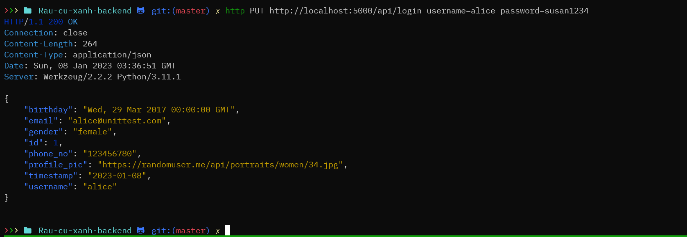

## Tóm tắt:
Database : 'app.db'. 

old_app: app cũ chạy đồ án kì trước(để tham khảo).

rau-cu-xanh.py : chạy app trong thư mục apps, với config là file config.py

app/models.py : các bảng trong database

app/__init__.py : file khởi tạo (theo template), chứa cài đặt logs.

app/main/routes.py : chứa các đường dẫn

app/main/api : chứa các api

app/forms.py, app/templates : liên quan đến web html css js

# Cách dùng trên localhost:
Bước 1: Clone repo này về

Bước 2: Cài đặt thư viện: `pip3 install -r requirements.txt`

Bước 3: Tạo và insert dữ liệu vào database: `./createdb.ps1` or `bash createdb.sh`

Bước 4: Chạy: `python3 -m flask run --host=0.0.0.0` sau đó thay url vào trong app VD http://192.168.42.253:5000

# Debug:
test.py : unit test chạy : `python3 test.py`

createdb.sh : tạo db mới với dữ liệu

input.py : Đưa dữ liệu vào database app.db

app.db : chứa cơ sở dữ liệu, Dùng sqlite browser để xem dữ liệu.

migrations : thư mục dùng để nâng cấp database (không quan trọng cho đồ án)

logs : nhật ký app

# API hoạt động:
Xem tại localhost:5000/api/

