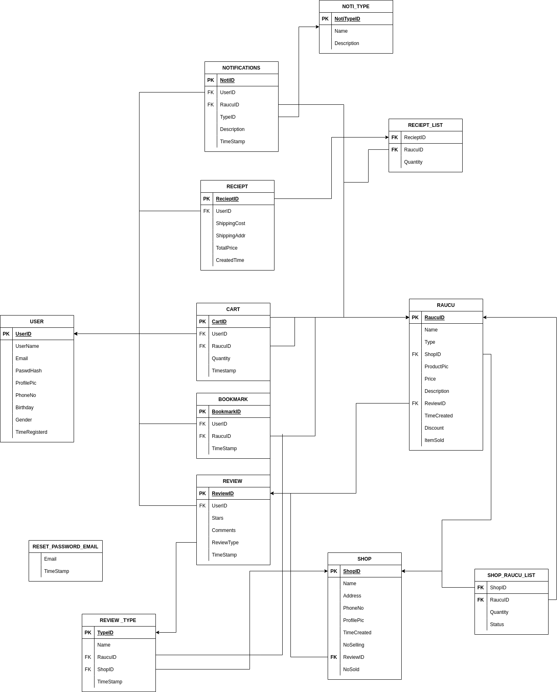

Tóm tắt:
Database : 'database/main.db' 

+ Xong phần tạo csdl : 'database/RauCuXanhDB.sql' <pre><code>sqlite3 main.db < RauCuXanhDB.sql</code></pre>
+ Dữ liệu demo : 'database/demoData.sql' cần insert thêm dữ liệu và bỏ hình vào thư mục hình ảnh <pre><code>sqlite3 main.db < demoData.sql</code></pre>
+ Hình profile người dùng, sản phẩm, shop : database/images/{shop,user,raucu}
+ Code & api : xong flow login, vài api đơn giản. Cần phát triển thêm
