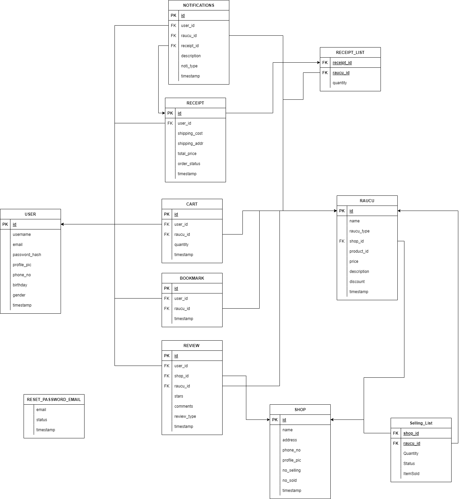

## Tóm tắt:
Database : 'app.db'. 

old_app: app cũ chạy đồ án kì trước(không cần để ý).

rau-cu-xanh.py : chạy app trong thư mục apps, với config là file config.py

app/models.py : các bảng trong database

app/__init__.py : file khởi tạo (theo template), chứa cài đặt logs.

app/routes.py : chứa các đường dẫn

app/forms.py, app/templates : liên quan đến web html css js

# Debug:
test.py : unit test chạy : `python3 test.py`

createdb.sh : tạo db mới trắng

input.py : tạo database mới và đưa dữ liệu vào

migrations : thư mục dùng để nâng cấp database (không quan trọng cho đờ án)

logs : nhật ký app
